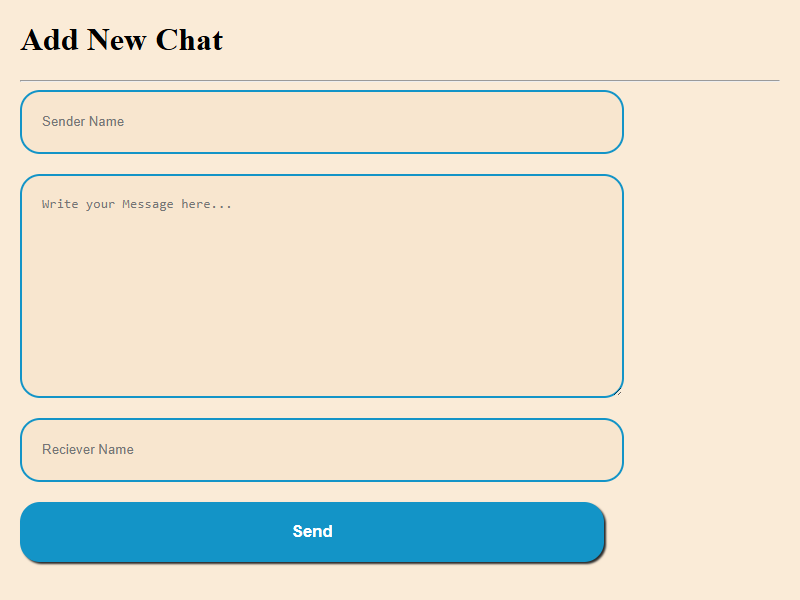

# MongoApp - Chat Management System

A simple chat management web application built with **Node.js**, **Express**, **EJS**, and **MongoDB**.  
It allows users to **add**, **edit**, and **delete** chats while providing a clean and responsive interface.  

---

## 🚀 Features
- Add new chats with ease  
- Edit existing chats  
- Delete chats with confirmation dialog  
- Responsive design (works on desktop & mobile)  
- Clean UI using **EJS templates**  

---

## 🛠️ Technologies Used
- **Node.js** – Backend framework  
- **Express.js** – Web application framework  
- **MongoDB** – Database for storing chats  
- **EJS** – Templating engine for dynamic views  
- **CSS** – Styling  

---

## 📸 Screenshots

### Add Chat


### All Chats


### Edit Chat


### Confirmation Dialogue


---

## ⚙️ Installation & Setup

1. **Clone the repository**
   ```bash
   git clone <your-repo-link>
   cd MongoApp
   ````

2. **Install dependencies**
   ```bash
   npm install
   ```

3. **Run the app**
   ```bash
   node init.js
   ```

The app will be running at: **[http://localhost:8080](http://localhost:8080)**

---

## 🔮 Future Improvements

* Add **user authentication** (login/signup)
* Add **search and filter functionality**
* Support for **multiple users & chat groups**
* Dark/Light mode toggle

---

## 🤝 Contributing

Contributions are welcome! Please fork the repo and submit a pull request.

---

## 📄 License

This project is licensed under the **MIT License**.

```